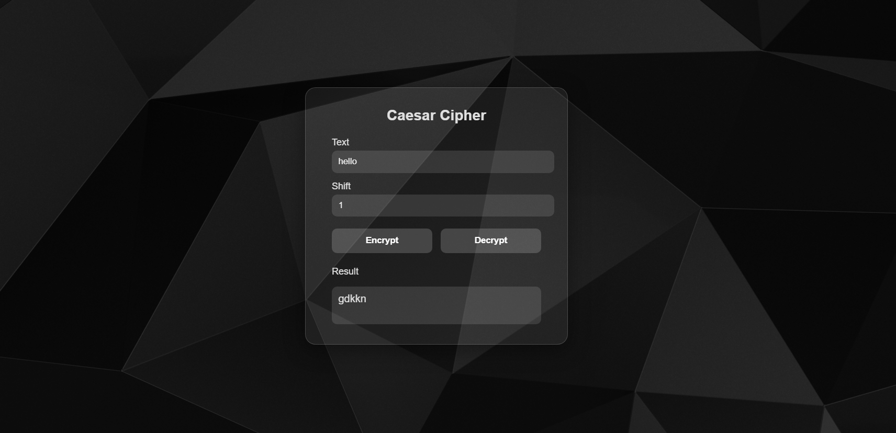

# 🕶️ Caesar Cipher – Glass UI (Web Version)

A sleek, responsive **Caesar Cipher encryption/decryption tool** built with **HTML, CSS, and JavaScript**. Features a modern **glassmorphism interface** and a stylish dark background.

---

## 🔐 Features

- Encrypt or decrypt any message using the Caesar Cipher technique.
- Beautiful **glassmorphic UI** with real-time response.
- Responsive dark-themed design.
- Lightweight: runs in any modern browser without dependencies.

---

## 🛠️ Technologies Used

- `HTML5`
- `CSS3` with `backdrop-filter` & glassmorphism
- `Vanilla JavaScript`

---

## 🚀 Getting Started

### ✅ Requirements
Just a modern web browser (Chrome, Edge, Firefox, etc.). No installation or internet required after download.

### 📥 How to Use
1. **Clone or download** this repository.
2. Open `index.html` in your preferred browser.
3. Enter the message and shift number.
4. Click **Encrypt** or **Decrypt** to see results instantly.

---

## 📸 Preview

> Caesar Cipher in action with frosted-glass UI and encrypted results.

---

## 🔁 Caesar Cipher – What Is It?

> Caesar Cipher is a simple substitution cipher where each letter in the plaintext is shifted a fixed number of places down or up the alphabet.

For example, using a shift of `+3`:
